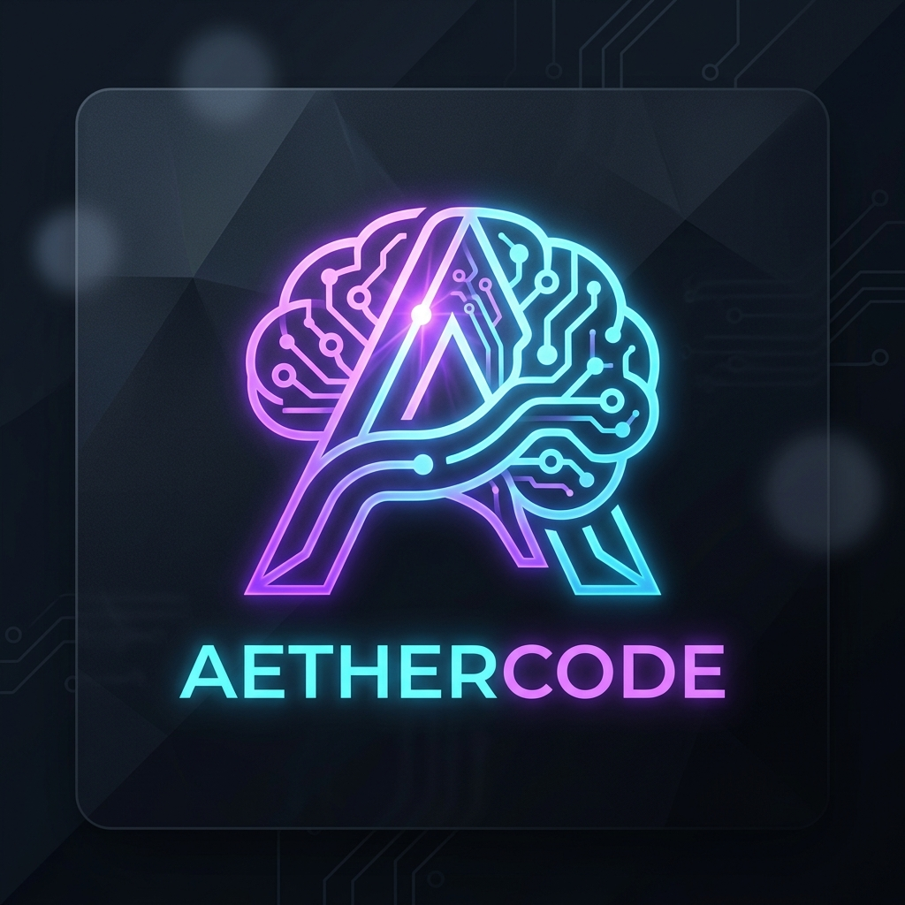
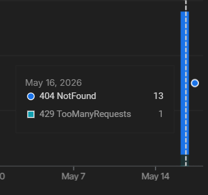
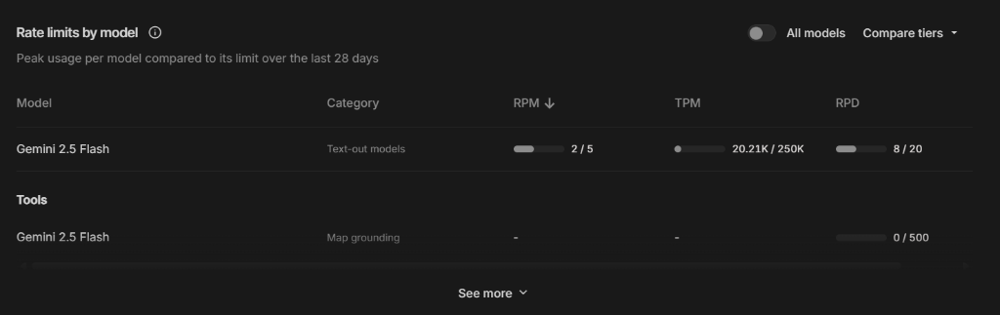

<div align="center">



# ⚡ AetherCode

### The Autonomous MERN Stack Engineer for VS Code

*A self-improving, multi-agent AI coding assistant powered by Google Gemini — built with Tree-of-Thoughts reasoning, persistent memory, and reinforcement learning.*

[](https://code.visualstudio.com/)
[](https://ai.google.dev/)
[](https://www.typescriptlang.org/)
[](LICENSE)

</div>

---

## 🧠 What is AetherCode?

AetherCode isn't just another AI code assistant — it's an **autonomous software engineer** that lives inside your VS Code sidebar. It breaks down complex tasks into reasoning trees, learns from its own mistakes through error pattern tracking, and continuously improves its strategies using MSE scoring and reward-based reinforcement.

> **Think of it as a 10x developer pair-programming with you, entirely powered by the Gemini API.**

---

## ✨ Features

### 🤖 Multi-Agent Architecture
A supervisor agent orchestrates specialized sub-agents, each responsible for a distinct phase of the development workflow:

| Agent | Role |
|-------|------|
| **Supervisor** | Task decomposition, orchestration, and self-learning |
| **Debug Agent** | Root cause analysis with automatic AST syntax/logic fixes |
| **Refactor Agent** | Code restructuring with safety-first diff previews |
| **Analyzer Agent** | Big-O algorithm complexity analysis and optimization |

### 🌳 Tree-of-Thoughts Reasoning
Tasks are decomposed into decision trees. The engine evaluates multiple solution paths, selects the best branch via confidence scoring, and supports **backtracking** when a path underperforms. The entire thought process is visualized live in the UI.

### 💾 Persistent Memory & SQLite
- **SQLite-backed** long-term memory across VS Code sessions
- **Error pattern tracking** — recognizes recurring bugs and automatically retrieves past successful fix strategies
- **Project Context** — understands your specific workspace architecture

### 🎨 Luminous Glassmorphic UI
A beautiful, animated, built-in VS Code webview featuring three specialized dashboards:
- **💬 Chat** — A glowing, conversational interface with auto-expanding input docks and neon animations.
- **🌳 Tree** — A visual reasoning tree displaying exactly what AetherCode is "thinking" right now.
- **🧠 Memory** — A stat-tracking dashboard displaying learned error patterns, overall agent accuracy, and active project context.

<p align="center">
  
  
</p>

---

## 🚀 Getting Started

### Prerequisites

- [VS Code](https://code.visualstudio.com/) v1.85 or later
- [Node.js](https://nodejs.org/) v18+
- A [Google Gemini API key](https://aistudio.google.com/apikey)

### Installation

```bash
# Clone the repository
git clone https://github.com/gvraghuveer/AetherCode.git
cd AetherCode

# Install dependencies
npm install

# Compile the extension
npm run compile
```

### Launch
1. Open the project in VS Code.
2. Press **`F5`** to launch the Extension Development Host.
3. In the new VS Code window, click the **⚡ AetherCode** icon in the Activity Bar.
4. Set your Gemini API key when prompted.
5. Start coding!

---

## 📋 Commands

Open the Command Palette (`Ctrl+Shift+P` / `Cmd+Shift+P`) and run:

| Command | Description |
|---------|-------------|
| `AetherCode: Open AI Assistant` | Open the sidebar chat interface |
| `AetherCode: Debug Current File` | Analyze and auto-fix the active file |
| `AetherCode: Refactor Current File` | Restructure code with diff preview |
| `AetherCode: Analyze Algorithm` | Deep complexity analysis (Time & Space) |
| `AetherCode: Set Gemini API Key` | Configure or update your API key |

---

## 🏗️ Architecture

```text
src/
├── agents/             # The AI Brain (Supervisor, Debugger, Refactor, Analyzer)
├── memory/             # Persistent SQLite Storage Engine
├── ml-engine/          # Self-Improvement & Reward Scoring
├── parsers/            # TypeScript AST Analysis
├── services/           # Gemini Client, Safety Guardrails, Workspace Context
├── tree-engine/        # Tree-of-Thoughts Path Evaluation
├── ui/                 # Glassmorphic Luminous Webview Provider
└── extension.ts        # Entry Point & Command Registration
```

---

## 🤝 Contributing

Contributions are welcome! 
1. Fork the repository
2. Create your feature branch (`git checkout -b feature/amazing-feature`)
3. Commit your changes (`git commit -m 'Add amazing feature'`)
4. Push to the branch (`git push origin feature/amazing-feature`)
5. Open a Pull Request

---

## 📄 License

This project is licensed under the MIT License — see the [LICENSE](LICENSE) file for details.

<div align="center">
<b>Built with ⚡ by <a href="https://github.com/gvraghuveer">G V Raghuveer</a></b><br>
<i>AetherCode — Code smarter, not harder.</i>
</div>